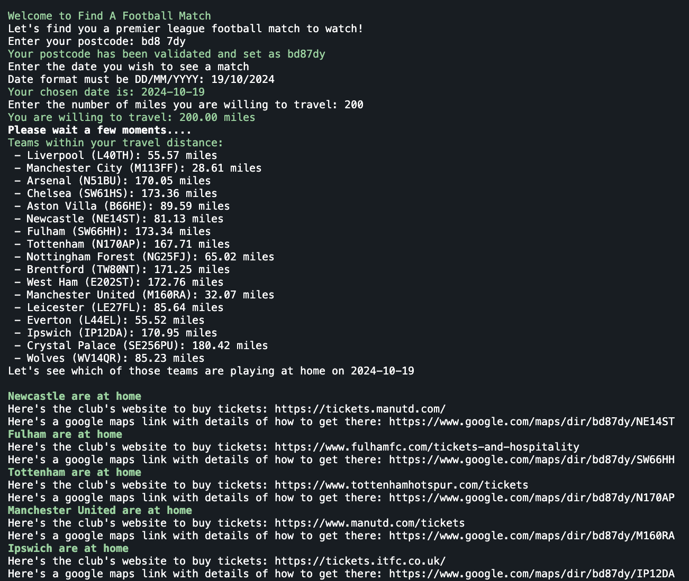
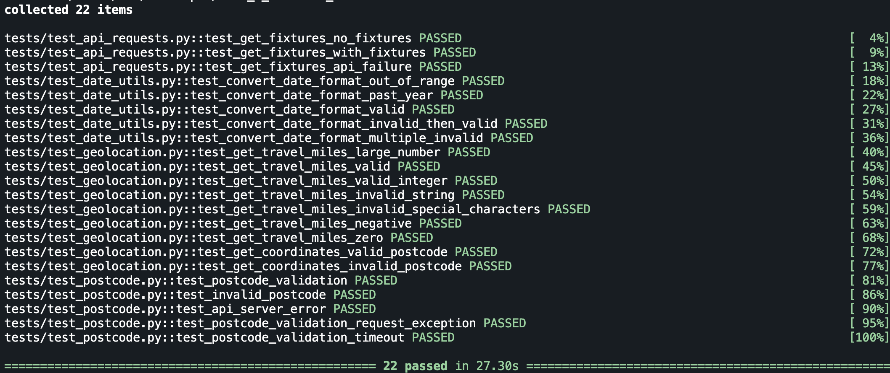

# Find a football match

# Application will prompt user in CLI for input for the following things:
- Their postcode
- Date on which they wish to see a game (must be no further in the future that 5 weeks away)
- How far they are willing to travel

# upon receipt of the above, application will display the following in the terminal:
- All football teams from the premier league that are playing at home within the users chosen distance, on the given day
- Print Google maps link to see how to get to each match from their postcode
- Print official website for team in order to check ticket availability.

# This repository also utilizes github actions to:
- perform code QL analysis on push or PR to main
- on success of above, package (test and lint in 3 python versions)
- on success of qbove, build and push docker image to dockerHub

## To run the docker image you will need a sports API key which can be obtained for free from the below link
- [Sports API](https://rapidapi.com/highlightly-api-highlightly-api-default/api/sport-highlights-api)
- to run the container simply run
```
docker run -it --name football -e SPORT_HIGHLIGHTS_API_KEY='<your api key>' samdroberts/football
```


